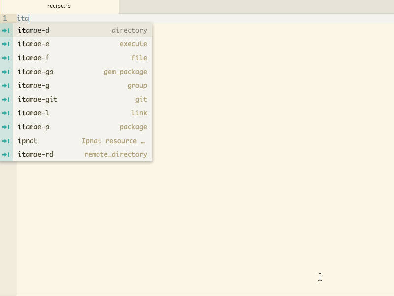

# Itamae Snippets

Snippets to help you writing Itamae Recipe.

## Itamae Resources

| Snippet | Description |
|:---|:---|
| `itamae-d`   | Itamae directory resource |
| `itamae-e`   | Itamae execute  resource |
| `itamae-f`   | Itamae file resource |
| `itamae-gp`  | Itamae gem_package resource |
| `itamae-git` | Itamae git resource |
| `itamae-g`   | Itamae group resource |
| `itamae-l`   | Itamae link resource |
| `itamae-lrb` | Itamae local_ruby_block resource |
| `itamae-p`   | Itamae package resource |
| `itamae-rd`  | Itamae remote_directory resource |
| `itamae-rf`  | Itamae remote_file resource |
| `itamae-s`   | Itamae service resource |
| `itamae-t`   | Itamae template resource |
| `itamae-u`   | Itamae user resource |

## Other Itamae snippets

| Snippet | Output |
|:---|:---|
| `itamae-node`  | `node[:name]` |
| `itamae-node2` | `#{node[:name]}` |
| `itamae-log`   | `Logger.info('message')` |
| `itamae-ir`    | `include_recipe "/path/to/recipe.rb"` |
